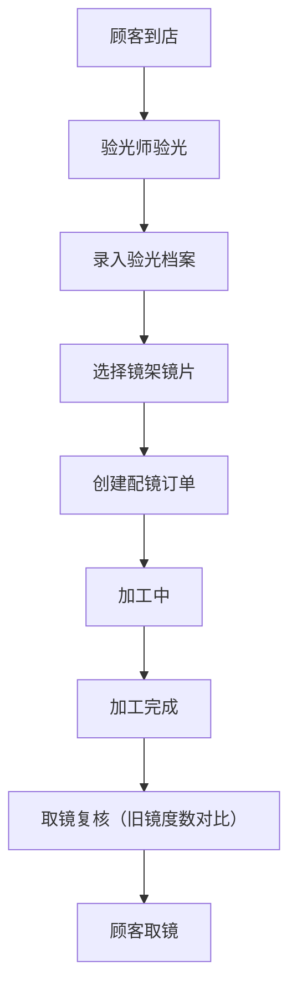

## 1. 产品概述
眼镜店验光配镜管理系统，为眼镜门店提供专业的验光档案管理、库存管理和订单跟踪一体化解决方案。

- 核心目的：帮助眼镜店规范化管理顾客验光数据、镜架镜片库存、配镜订单流程，提升门店运营效率和服务质量
- 目标用户：眼镜店验光师、库存管理员、销售人员
- 市场价值：替代传统纸质记录，实现数字化管理，降低出错率，提升顾客体验

## 2. 核心功能

### 2.1 用户角色
| 角色 | 注册方式 | 核心权限 |
|------|----------|----------|
| 验光师 | 系统分配账号 | 验光档案录入、查询、修改，验光度数复核 |
| 库存管理员 | 系统分配账号 | 镜架/镜片库存管理、出入库登记 |
| 销售人员 | 系统分配账号 | 订单创建、状态跟踪、取镜复核 |

### 2.2 功能模块
1. **验光档案管理**：顾客信息管理、验光记录管理（左右眼球镜/柱镜/轴位/瞳距/ADD）、历史记录查询
2. **镜架库存管理**：镜架信息录入（品牌/型号/材质/颜色/进价/售价）、库存查询、出入库管理
3. **镜片库存管理**：镜片信息录入（折射率/膜层/品牌/进价/售价）、库存查询、出入库管理
4. **配镜订单管理**：订单创建（镜架+镜片组合）、加工状态跟踪、取镜管理
5. **取镜复核功能**：旧镜度数复核、度数对比确认

### 2.3 页面详情
| 页面名称 | 模块名称 | 功能描述 |
|-----------|----------|----------|
| 首页仪表盘 | 数据概览 | 今日验光数、待加工订单、库存预警、销售统计 |
| 验光档案页 | 顾客列表 | 顾客信息增删改查、搜索过滤 |
| 验光档案页 | 验光记录 | 验光记录录入、左右眼数据录入、历史记录查看 |
| 镜架库存页 | 库存列表 | 镜架信息展示、搜索筛选、库存预警提示 |
| 镜架库存页 | 库存管理 | 镜架信息录入、修改、删除、出入库登记 |
| 镜片库存页 | 库存列表 | 镜片信息展示、搜索筛选、库存预警提示 |
| 镜片库存页 | 库存管理 | 镜片信息录入、修改、删除、出入库登记 |
| 订单管理页 | 订单列表 | 订单展示、状态筛选、搜索 |
| 订单管理页 | 订单创建 | 选择顾客、选择镜架镜片、录入配镜信息 |
| 订单管理页 | 状态跟踪 | 加工状态更新（待加工/加工中/已完成/已取镜） |
| 取镜复核页 | 取镜确认 | 旧镜度数展示、新镜度数对比、复核确认 |

## 3. 核心流程

### 3.1 验光流程
验光师登录系统 → 搜索/新增顾客 → 录入顾客信息 → 录入验光数据（左右眼球镜/柱镜/轴位/瞳距/ADD）→ 保存验光记录

### 3.2 配镜订单流程
销售人员登录系统 → 选择顾客 → 选择验光记录 → 选择镜架 → 选择镜片 → 创建订单 → 更新加工状态 → 取镜复核 → 完成取镜

### 3.3 库存管理流程
库存管理员登录系统 → 录入镜架/镜片信息 → 管理库存数量 → 设置库存预警阈值 → 查看库存预警

## 4. 用户界面设计

### 4.1 设计风格
- 主色调：深蓝色(#1e3a8a)，专业医疗感
- 辅助色：天蓝色(#3b82f6)，用于强调和交互
- 中性色：深灰(#1f2937)、中灰(#6b7280)、浅灰(#f3f4f6)
- 按钮风格：圆角矩形，微阴影，悬停时有轻微上浮效果
- 字体："Noto Sans SC" 中文无衬线字体，标题加粗，正文清晰易读
- 布局风格：卡片式布局，顶部导航+左侧菜单，信息分级清晰
- 图标风格：简洁线性图标，统一24px尺寸

### 4.2 页面设计概览
| 页面名称 | 模块名称 | UI元素 |
|-----------|----------|--------|
| 首页仪表盘 | 数据概览 | 统计卡片、趋势图表、预警提示 |
| 验光档案页 | 表单录入 | 左右眼分栏布局、数据输入框、日期选择器 |
| 库存管理页 | 库存列表 | 数据表格、筛选器、操作按钮 |
| 订单管理页 | 订单卡片 | 状态标签、时间线、进度指示 |
| 取镜复核页 | 对比视图 | 左右对比布局、度数对比表、确认按钮 |

### 4.3 响应式
- 桌面端优先设计，1280px以上最佳体验
- 平板端自适应，1024px布局调整
- 移动端适配，768px以下菜单折叠、单列布局

### 4.4 交互动效
- 页面切换淡入淡出过渡
- 表单输入焦点高亮
- 按钮悬停上浮效果
- 状态变化动画提示
- 数据加载骨架屏
