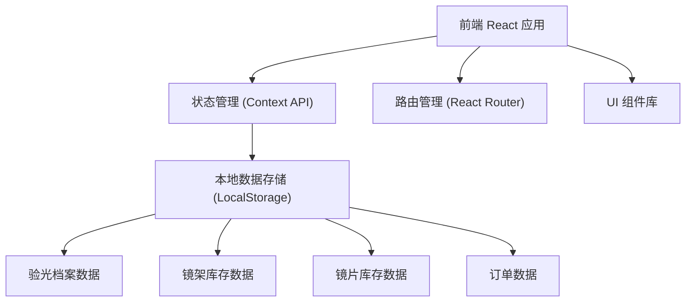
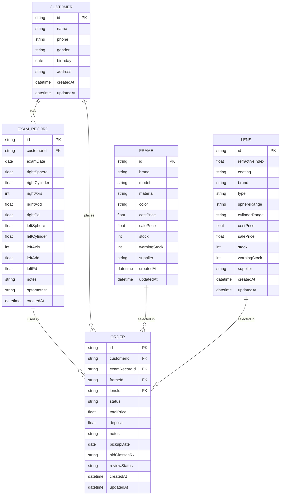

## 1. 架构设计



## 2. 技术描述
- 前端：React@18 + TypeScript + TailwindCSS@3 + Vite@5
- 初始化工具：Vite
- 路由：React Router DOM@6
- 状态管理：React Context API + useReducer
- 图标：Lucide React
- 数据持久化：LocalStorage（内置Mock数据）
- 日期处理：date-fns

## 3. 路由定义
| 路由 | 页面 | 用途 |
|------|------|------|
| / | 首页仪表盘 | 数据概览、快捷入口 |
| /customers | 顾客档案列表 | 顾客信息管理、搜索 |
| /customers/:id | 顾客详情 | 顾客信息、验光记录列表 |
| /customers/:id/exam/new | 新增验光 | 录入验光数据 |
| /customers/:id/exam/:examId | 验光详情 | 查看验光记录 |
| /frames | 镜架库存 | 镜架库存列表、管理 |
| /frames/new | 新增镜架 | 录入镜架信息 |
| /frames/:id/edit | 编辑镜架 | 修改镜架信息 |
| /lenses | 镜片库存 | 镜片库存列表、管理 |
| /lenses/new | 新增镜片 | 录入镜片信息 |
| /lenses/:id/edit | 编辑镜片 | 修改镜片信息 |
| /orders | 订单列表 | 订单展示、状态筛选 |
| /orders/new | 新建订单 | 创建配镜订单 |
| /orders/:id | 订单详情 | 订单信息、状态更新 |
| /orders/:id/pickup | 取镜复核 | 旧镜度数复核、取镜确认 |

## 4. 数据模型

### 4.1 实体关系图



### 4.2 数据类型定义

```typescript
// 顾客信息
interface Customer {
  id: string;
  name: string;
  phone: string;
  gender: '男' | '女';
  birthday: string;
  address: string;
  createdAt: string;
  updatedAt: string;
}

// 验光记录
interface ExamRecord {
  id: string;
  customerId: string;
  examDate: string;
  rightEye: EyePrescription;
  leftEye: EyePrescription;
  pd: number; // 瞳距
  notes: string;
  optometrist: string;
  createdAt: string;
}

// 单眼验光数据
interface EyePrescription {
  sphere: number; // 球镜
  cylinder: number; // 柱镜
  axis: number; // 轴位
  add: number; // 下加光
  visualAcuity: string; // 矫正视力
}

// 镜架库存
interface Frame {
  id: string;
  brand: string;
  model: string;
  material: string;
  color: string;
  costPrice: number;
  salePrice: number;
  stock: number;
  warningStock: number;
  supplier: string;
  createdAt: string;
  updatedAt: string;
}

// 镜片库存
interface Lens {
  id: string;
  refractiveIndex: number;
  coating: string;
  brand: string;
  type: string;
  sphereRange: string;
  cylinderRange: string;
  costPrice: number;
  salePrice: number;
  stock: number;
  warningStock: number;
  supplier: string;
  createdAt: string;
  updatedAt: string;
}

// 配镜订单
interface Order {
  id: string;
  customerId: string;
  examRecordId: string;
  frameId: string;
  lensId: string;
  status: 'pending' | 'processing' | 'completed' | 'picked';
  totalPrice: number;
  deposit: number;
  notes: string;
  pickupDate: string;
  oldGlassesRx: OldGlassesRx | null;
  reviewStatus: 'pending' | 'reviewed';
  createdAt: string;
  updatedAt: string;
}

// 旧镜度数
interface OldGlassesRx {
  rightEye: EyePrescription;
  leftEye: EyePrescription;
  pd: number;
}

// 订单状态枚举
type OrderStatus = 'pending' | 'processing' | 'completed' | 'picked';
```

### 4.3 初始Mock数据

```typescript
// 初始顾客数据
const mockCustomers: Customer[] = [
  {
    id: '1',
    name: '张三',
    phone: '13800138001',
    gender: '男',
    birthday: '1990-05-15',
    address: '北京市朝阳区',
    createdAt: '2024-01-15T10:00:00Z',
    updatedAt: '2024-01-15T10:00:00Z'
  }
];

// 初始验光记录
const mockExamRecords: ExamRecord[] = [
  {
    id: '1',
    customerId: '1',
    examDate: '2024-01-15',
    rightEye: { sphere: -2.5, cylinder: -0.5, axis: 180, add: 0, visualAcuity: '1.0' },
    leftEye: { sphere: -2.0, cylinder: -0.25, axis: 170, add: 0, visualAcuity: '1.0' },
    pd: 64,
    notes: '双眼近视，初次配镜',
    optometrist: '李医生',
    createdAt: '2024-01-15T10:30:00Z'
  }
];

// 初始镜架库存
const mockFrames: Frame[] = [
  {
    id: '1',
    brand: '雷朋',
    model: 'RB5154',
    material: '板材',
    color: '黑色',
    costPrice: 280,
    salePrice: 580,
    stock: 12,
    warningStock: 3,
    supplier: '雷朋中国总代理',
    createdAt: '2024-01-01T00:00:00Z',
    updatedAt: '2024-01-01T00:00:00Z'
  }
];

// 初始镜片库存
const mockLenses: Lens[] = [
  {
    id: '1',
    refractiveIndex: 1.56,
    coating: '防蓝光',
    brand: '依视路',
    type: '单光',
    sphereRange: '-10.00 ~ +6.00',
    cylinderRange: '-2.00 ~ 0',
    costPrice: 180,
    salePrice: 380,
    stock: 25,
    warningStock: 5,
    supplier: '依视路中国',
    createdAt: '2024-01-01T00:00:00Z',
    updatedAt: '2024-01-01T00:00:00Z'
  }
];
```

## 5. 核心模块设计

### 5.1 目录结构
```
src/
├── components/         # 通用组件
│   ├── Layout.tsx
│   ├── Sidebar.tsx
│   ├── Header.tsx
│   ├── DataTable.tsx
│   ├── Modal.tsx
│   └── StatusBadge.tsx
├── pages/             # 页面组件
│   ├── Dashboard.tsx
│   ├── customers/
│   │   ├── List.tsx
│   │   ├── Detail.tsx
│   │   ├── ExamForm.tsx
│   │   └── ExamDetail.tsx
│   ├── frames/
│   │   ├── List.tsx
│   │   └── Form.tsx
│   ├── lenses/
│   │   ├── List.tsx
│   │   └── Form.tsx
│   └── orders/
│       ├── List.tsx
│       ├── New.tsx
│       ├── Detail.tsx
│       └── Pickup.tsx
├── context/           # 状态管理
│   ├── CustomerContext.tsx
│   ├── FrameContext.tsx
│   ├── LensContext.tsx
│   └── OrderContext.tsx
├── types/             # TypeScript类型定义
│   └── index.ts
├── utils/             # 工具函数
│   ├── storage.ts
│   ├── mockData.ts
│   └── helpers.ts
├── App.tsx
├── main.tsx
└── index.css
```

### 5.2 核心功能实现要点

1. **验光档案模块**
   - 左右眼分栏布局，清晰对比
   - 球镜/柱镜支持正负值输入
   - 轴位范围校验（0-180度）
   - 瞳距单独录入
   - ADD（下加光）用于老花镜
   - 历史验光记录时间线展示

2. **库存管理模块**
   - 进价/售价金额格式化
   - 库存预警阈值设置
   - 低库存红色高亮提示
   - 出入库记录追踪

3. **订单管理模块**
   - 镜架+镜片组合选择
   - 自动计算总价
   - 加工状态时间线
   - 状态流转控制

4. **取镜复核模块**
   - 旧镜度数录入
   - 新旧度数左右对比表格
   - 差异高亮显示
   - 复核确认签字流程
